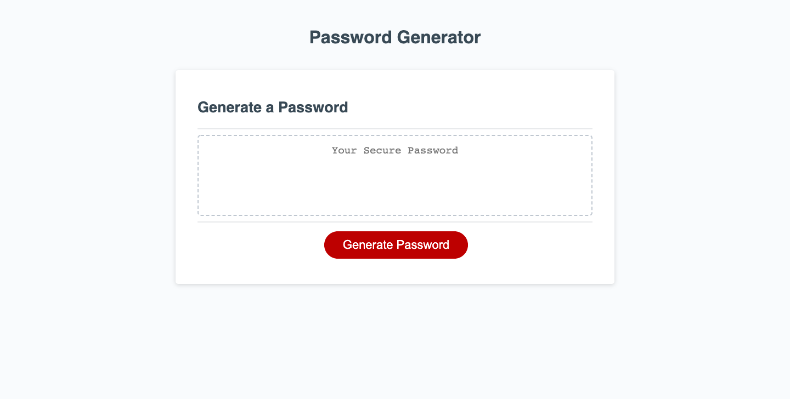

Challenge 3: Password Generator  

This weeks Javascript challenge consists of adding javascript functions to code to generate a random password that fits user created parameters. Password must be between 8 and 128 characters and include atleast 1 character type, user declares how many characters they would like and ask yes or no statements to determine which character tyoes the uset would like in their password. If no character type is selected, the user recieves a "Try Again" prompt. The password is computed and displayed on text box.

URL:
https://gdav24.github.io/challenge-3-js/

Repo:
git@github.com:GDav24/challenge-3-js.git

Screenshot of portfolio:
